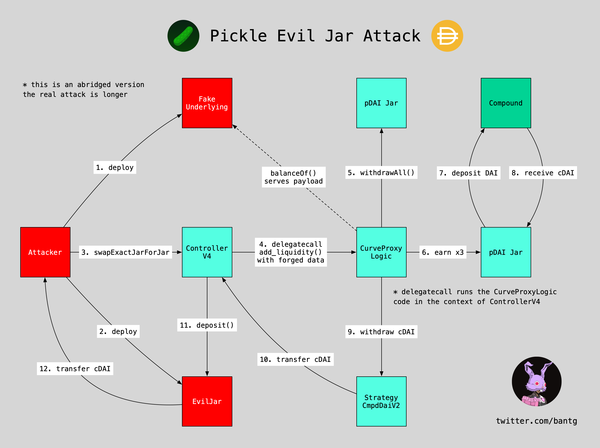

# Evil Jar Technical Post-mortem



## Authors

[@banteg](https://github.com/bantg) [@emilianobonassi](https://github.com/emilianobonassi) [@lehnberg](https://github.com/lehnberg) [@samczsun](https://github.com/samczsun) [@vasa-develop](https://github.com/vasa-develop) [@bneiluj](https://github.com/bneiluj)

## Summary

- On Saturday November 21 2020, an attacker drained 19 million DAI from pickle.finance's pDAI Jar.
- Taking advantage of multiple flaws in the system, including issues with the Jar swap and Jar convert logic, the attacker was able to craft a sophisticated exploit to carry out the heist.
- Dubbed "Evil Jar", the attack has been reverse-engineered successfully with details shared below.

## Background

Pickle Jars are forked versions of Yearn Vaults v1 with modifications. The Jars are controlled by a Controller contract, its latest version enabling direct swaps between Jars. It was this added swap functionality that was leveraged together with multiple design flaws in order to execute the attack.

## Details of vulnerability

Pickle [ControllerV4](https://github.com/pickle-finance/protocol/blob/4d7ecfa766536622848a29407c0464283d11fb67/src/controller-v4.sol#L250-L336)'s `swapExactJarForJar()` function can be used to drain non-Jar tokens from Strategies or tokens that end up in the Controller.

```solidity
// Function to swap between jars
function swapExactJarForJar(
    address _fromJar, // From which Jar
    address _toJar, // To which Jar
    uint256 _fromJarAmount, // How much jar tokens to swap
    uint256 _toJarMinAmount, // How much jar tokens you'd like at a minimum
    address payable[] calldata _targets,
    bytes[] calldata _data
) external returns (uint256)
```

An attacker can craft an **EvilJar** contract with a part of the exploit payload, as well as a **FakeUnderlying** contract, which holds another part of the payload.

EvilJar is passed as both `_fromJar` and `_toJar` arguments. Since Controller doesn't verify if the Jar contract is legit, it's enough to implement `token`, `getRatio`, `decimals`, `transfer`, `transferFrom`, `approve`, `allowance`, `balanceOf`, `withdraw` and `deposit` functions to make it work with the Jar.

The `deposit()` function holds the payload and transfers the tokens from the Controller to the attacker. It could look like this:

```python
@external
def deposit(amt: uint256):  # payload
    self.token.transferFrom(msg.sender, self.owner, amt)
```

It would be called here, with `_toJar` being the EvilJar and `_toBal` being the token balance in the Controller:

```solidity
// Deposit into new Jar
uint256 _toBal = IERC20(_toJarToken).balanceOf(address(this));
IERC20(_toJarToken).safeApprove(_toJar, 0);
IERC20(_toJarToken).safeApprove(_toJar, _toBal);
IJar(_toJar).deposit(_toBal);
```

The above makes it possible to drain funds from the Controller. For this to have effect, there needs to be funds there to drain.

A user can provide a list of arbitrary `_targets` and `_data`. Each target needs to be marked as `approvedJarConverter`:

```solidity
for (uint256 i = 0; i < _targets.length; i++) {
    require(_targets[i] != address(0), "!converter");
    require(approvedJarConverters[_targets[i]], "!converter");
}
```

At the time of this writing, there are two Jar Converters approved:
1. [UniswapV2ProxyLogic](https://ethtx.info/mainnet/0x217f9239ed23325a775cf5a951aad878bdcee3f6ffd8daf91f9d7098b2800491)
2. [CurveProxyLogic](https://ethtx.info/mainnet/0x9d25b1872d6588c5fb69e83cc1a62f401d974b91ccfb9e1bf2f4d0a7618cd1f0), this one is vulnerable and allows code injection

After withdrawing funds from the fabricated EvilJar, the controller [delegate calls](https://github.com/pickle-finance/protocol/blob/4d7ecfa766536622848a29407c0464283d11fb67/src/controller-v4.sol#L338-L370) the provided Converters with the data provided by the attacker. This means an attacker can call the code from their contract in the context of the Controller.

[CurveProxyLogic](https://github.com/pickle-finance/protocol/blob/4d7ecfa766536622848a29407c0464283d11fb67/src/proxy-logic/curve.sol#L27-L54) has the following function which can be used to inject an arbitrary call:

```solidity
function add_liquidity(
    address curve,
    bytes4 curveFunctionSig,
    uint256 curvePoolSize,
    uint256 curveUnderlyingIndex,
    address underlying
) public {
    uint256 underlyingAmount = IERC20(underlying).balanceOf(address(this));
    ...
    bytes memory callData = abi.encodePacked(
        curveFunctionSig,
        liquidity,
        uint256(0)
    );
    ...
    (bool success, ) = curve.call(callData);
}
```
By supplying a target address as `curve`, a function 4-byte identifier as `curveFunctionSig` and **FakeUnderlying** as `underlying`, an attacker can make the Controller call a function in the target Strategy, with a limitation of that function requiring zero or one argument.

A FakeUnderlying contract needs to implement `balanceOf`, `allowance` and `approve` to work. The exploit payload goes into the `balanceOf`, which sets the first argument of the function to be called:

```python
@view
@external
def balanceOf(src: address) -> (address):
    return self.target
```

In this case, calling [`Strategy.withdraw(address)`](https://github.com/pickle-finance/protocol/blob/4d7ecfa766536622848a29407c0464283d11fb67/src/strategies/strategy-base.sol#L139-L145), seizes dust that is sent to the Controller.

As a preventive measure, the function disallows withdrawing the `want` token, which is the deposit token of the Jar. So in the case of the pDAI Jar, it would not allow stealing DAI this way. However, the pDAI Jar's Strategy holds cDAI, a tokenized Compound deposit, and considers this incorrectly to be dust.

It was the combination of the above flaws that allowed the attacker to proceed with the exploit.

## Details of exploit

### Reverse-engineered Exploit

Our simplified and more efficient reproduction of the exploit is published at https://github.com/banteg/evil-jar. Note that it is different from what was actually used in the attack.

- banteg's version
    - [EvilJar.vy](https://github.com/banteg/evil-jar/blob/master/contracts/EvilJar.vy)
    - [FakeUnderlying.vy](https://github.com/banteg/evil-jar/blob/master/contracts/FakeUnderlying.vy)
    - [exploit.py](https://github.com/banteg/evil-jar/blob/master/scripts/exploit.py)
- [samczsun's version](https://github.com/banteg/evil-jar/blob/master/reference/samczsun.sol)

### Original Exploit

Exploit [transaction trace](https://ethtx.info/mainnet/0xe72d4e7ba9b5af0cf2a8cfb1e30fd9f388df0ab3da79790be842bfbed11087b0).

1. Deploy two Evil Jars
    - [0x75aa95508f019997aeee7b721180c80085abe0f9](https://etherscan.io/address/0x75aa95508f019997aeee7b721180c80085abe0f9 ) 
    -  [0x02c8364546ec849e1726fb6cae5228702b111ee6](https://etherscan.io/address/0x02c8364546ec849e1726fb6cae5228702b111ee6)

2. Get the amount available to withdraw from StrategyCmpdDaiV2
`StrategyCmpdDaiV2.getSuppliedUnleveraged()` => 19728769153362174946836922

3. Invoke `ControllerV4.swapExactJarForJar()` passing the Evil Jars and the amount retrieved in the previous step.

4. `ControllerV4.swapExactJarForJar()` doesn't check the Jars and calls them, withdrawing from `StrategyCmpDAIV2` using `StrategyCmpDAIV2.withdrawForSwap()` which ultimately uses`StrategyCmpDAIV2.deleverageToMin()`. This transfers 19M DAI to pDAI. We are still in Pickle Contracts, in this part of the attack Evil Jars were used just to put the funds to pDAI.

5. Call `pDAI.earn()` 3 times. This invokes a Compound deposit via `StrategyCmpDAIV2.deposit()`, leading to the contract receiving cDAI. `StrategyCmpdDAIV2` now has an equivalent of 19M in cDAI.

6. Deploy 3 more evil contracts, the first one being the equivalent of FakeUnderlying in our replicated exploit and the other two Evil Jars.
    - [0x8739c55df8ca529dce060ed43279ea2f2e122122](https://etherscan.io/address/0x8739c55df8ca529dce060ed43279ea2f2e122122)
    - [0xa2da08093a083c78c21aeca77d6fc89f3d545aed](https://etherscan.io/address/0xa2da08093a083c78c21aeca77d6fc89f3d545aed)
    - [0xa445e12d69e8bd60290f6935d49ff39ba31c6115](https://etherscan.io/address/0xa445e12d69e8bd60290f6935d49ff39ba31c6115)

7. Invoke `ControllerV4.swapExactJarForJar()` passing the Evil Jars, no amount and a `CurveProxyLogic` as target with a crafted data which allowed an injection to call the equivalent `FakeUnderlying`.

8. `ControllerV4` delegate calls [`CurveProxyLogic.add_liquidity()`](https://etherscan.io/address/0x6186e99d9cfb05e1fdf1b442178806e81da21dd8) passing `StrategyCmpDAIV2` and a crafted signature which leads to withdrawal of cDAI and transferring them to `ControllerV4`.

9. The funds (in cDAI) are now in the Controller, it calls the `EvilJar.deposit()` which transfer the funds to the attacker smart contract.

10. The attacker smart contract redeems cDAI for DAI from Compound and transfers DAI to the attacker EOA.


## Details of fix

[To be filled by Pickle team.]

## Timeline of events

- **2020-11-21 18:37 (UTC)** An attacker [drains 19,759,355 DAI](https://ethtx.info/mainnet/0xe72d4e7ba9b5af0cf2a8cfb1e30fd9f388df0ab3da79790be842bfbed11087b0) from pDAI Jar.
- **22:49** Artem, Emiliano, Sam, Julen, Vaibhav and Pickle devs start a war room call to replicate the exploit.
- **2020-11-22 01:15** A governance switch from Timelock to multisig is [initiated](http://ethtx.info/mainnet/0x605d50b0cd8b43f799f0fc7b4d5128ce480223cdf00) `ControllerV4.setGovernance(multisig_addr)`.
- **01:32** Exploit is successfully replicated and narrowed down to the actually vulnerable parts.
- **02:05** Sam publishes his version of the exploit.
- **03:58** pDAI Jar [deposits are disabled](https://ethtx.info/mainnet/0x784a56fc30bd69e4c60bbf0ad172896244ba60b146352aa0103fd9a9e6af8b18) by calling `setMin(0)` in the Timelock for 12 hours
- **11:43** 22.6 COMP withdrawn from Strategy by `Controller.strategist`
    - [`ControllerV4.inCaseStrategyTokenGetStuck`](https://ethtx.info/mainnet/0x6a6cc3446a4a44f741c36d0ac758b6241d60a93e108e68c3c323943d301f2f95)
    - [`ControllerV4.inCaseTokensGetStuck`](https://ethtx.info/mainnet/0xcb33620d962b55f5696ce88ce449bdcf40d7d467dfe0059b8ca8a9e97cb2d963)
- **15:16** CurveProxyLogic [has been revoked](https://ethtx.info/mainnet/0x718495b34b1fa33945aea2c694568f099b84198be9490386c36cd456be3539f8).

## References

- [Peckshield's root cause analysis](https://peckshield.medium.com/pickle-incident-root-cause-analysis-5d73496ebc9f)
- [orbxball's thread](https://twitter.com/orbxball/status/1330395576593211392)
- [transaction of actual hack](https://etherscan.io/tx/0xe72d4e7ba9b5af0cf2a8cfb1e30fd9f388df0ab3da79790be842bfbed11087b0)
- [transaction trace](https://ethtx.info/mainnet/0xe72d4e7ba9b5af0cf2a8cfb1e30fd9f388df0ab3da79790be842bfbed11087b0)
- [pickle contracts directory](https://github.com/pickle-finance/contracts)
- [Evil Jar Repo](https://github.com/banteg/evil-jar)
- [vasa's diagram](https://twitter.com/vasa_develop/status/1330532691205361664/photo/1)
